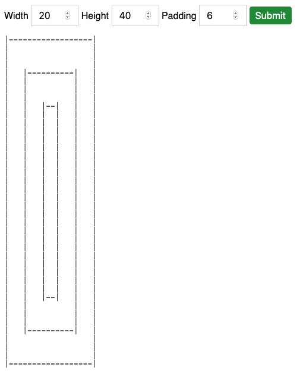

# Infinite recursive rectangle generator

[](https://travis-ci.com/munkacsimark/infinite-recursive-rectangle)

Rectangle generator written in Typescript using recursive function.

## Install and testing

### 1. Install dependencies

```bash
$ npm install
```

### 2. Run in terminal

Parameters in line: width, height, padding

```bash
$ npm run start -- 20 20 4 
```

### 3. Build and run in browser

```bash
$ npm run build:site
```

Open: \<repo-folder\>/site/index.html

### 4. Run tests in terminal

```bash
$ npm run test
```

## Complexity

O(2^n) - exponential

## 5. Screenshots

### Input: 20, 40, 6


### Input: 60, 60, 10


### Input: 80, 20, 16

